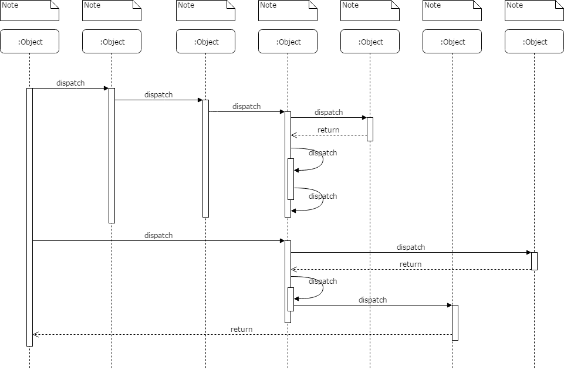

# Detailed Design (详细设计规约)

(Note: Not all sections are required, just need to select some necessary sections according to your project.)

## Data Models (数据建模)

### Entity-Relation Design (实体-关系设计)

### Database Design (数据库设计)

Here gives a table template:

**Table: User**

| Column | Type | Description |
|:---:|:---:|:---|
| id | integer | key, identifier |
| name | char[64] | name of the user |

## Interface Specifications （接口规约）

## Process Flow Design （过程流设计）

The sequence diagram is required, to show the whole process of the system from the entry point to the end point, for each user scenario. Here gives a sample: 

## Algorithm Design (算法设计)