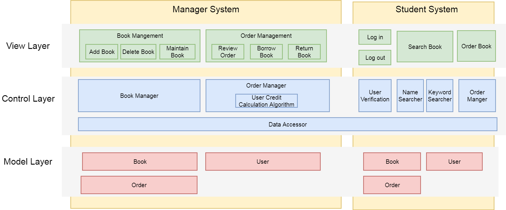
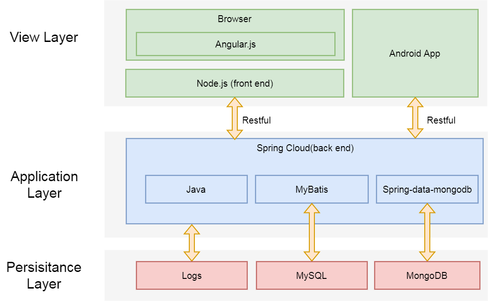
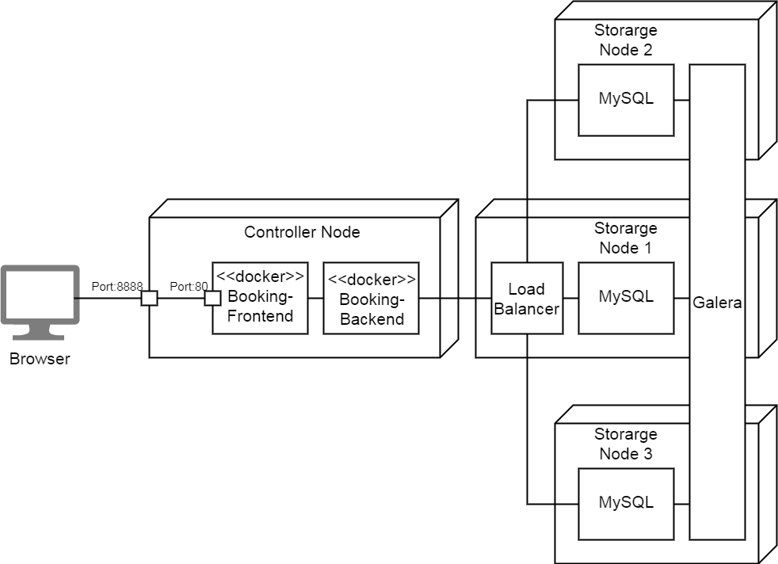

# High-level Design (概要设计规约)

## Prototype Design (原型设计)

The UI design of the project, add some mockups here. Here is a sample drawn by draw.io:


## Business Architecture (业务架构)

The business architecture outline the key components in each layers of the project systems. Here is a sample:




## Technology Architecture (技术架构)

The architecture of the technology stacks (coding language, frameworks, libraries, styles, etc) used in the project. Here gives an example:



## Deployment Topology (部署结构)

Deployment Topology shows how the whole project is deployed in the physical environment, including servers, VMs/containers, networks, key components, etc. A overview picture is required to show the topology. Here is a sample picture of Deployment Topology:



## Data Models (数据建模)

### Entity-Relation Design (实体-关系设计)

An Entity-Relation Diagram is required to show the concepts in the project and their relations. And for each entity and realtion, there should be a description after the diagram.

Here gives a sample E-R diagram:


### Database Design (数据库设计)

According to the Entity-Realtion Design, the detailed database design for entities and relations should be listed as tables. Here gives a table template:

**Table: User**

| Column | Type | Description |
|:---:|:---:|:---|
| id | integer | key, identifier |
| name | char[64] | name of the user |


## Interface Specifications （接口规约）

The specifications of interfaces used in interactions among subsystems, here gives a RESTful example in the style of [Swagger](https://swagger.io/):

---
### *customer/name*   

#### Description (接口描述)

Get the name of a customer.

| | |
|-|-|
| Request Method | Get |
| Authorization | Required |


#### Parameters (参数)

| Name | Located in | Description | Required | Schema |
|:-:|:-:|:-|:-:|:-|
| id | query | customer id | Yes | number(double) |

#### Responses (返回结果)

| Code | Description | Schema |
|:----:|:--------|:--|
| 200 | Successful response | *name* : string | 

#### Request Sample (示例请求)

```
customer/name?userId=214
```

#### Response Sample (示例结果)

```
{

  "name" : "Kanglin Yin"

}

```
---