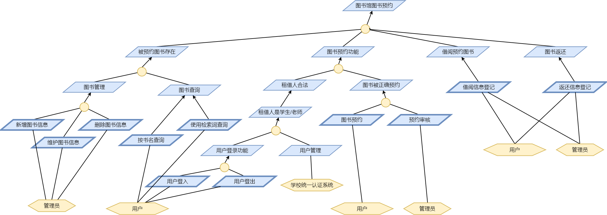
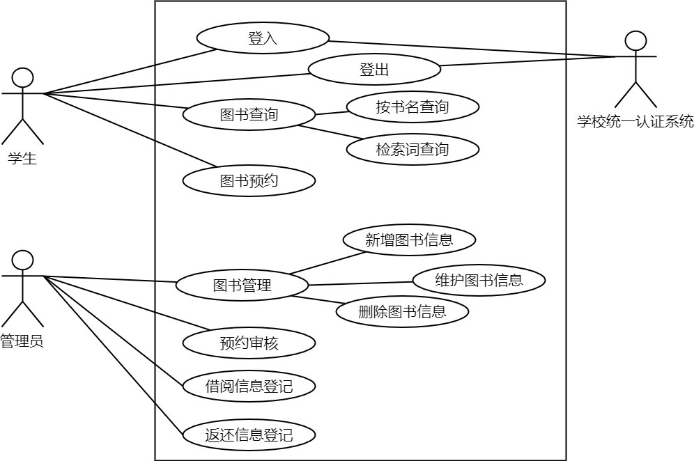

# Requirement Specification (需求规约)

## Project Introduction (项目介绍)

The detailed introduction of the project, the following information are required to mentioned:

- background
- purpose of the project
- target users
- boundary of the project (what to project will do and what the project won't do)

## Rquirement Analysis (项目需求分析)

Using a KAOS diagram to decompose the project form high-level goals to user scenarios. Here gives a sample KAOS diagram for a library booking system:

## Use Case Analysis (用例分析)

Based on the Requirement Analysis, make a Use Case Diagram for the project, and write use case specifications for each use case.

Here gives a sample use case diagram and a template of a use case:

---

### Use Case: _Use Case Name_

#### Description

Describes what the use case do.

#### Participants

Who (Users, systems) will attend the use case.

#### Pre-condition (Optional)

The conditions should be satisfied before the use case starts.

#### Post-condition (Optional)

The conditions will be satisfied after the use case finishes.

#### Process Flow

The process of the test case, either text descriptiopn or flow charts can be used here.

#### Exceptions (Optional)

Exceptions of the use case and how it is resolved.

---